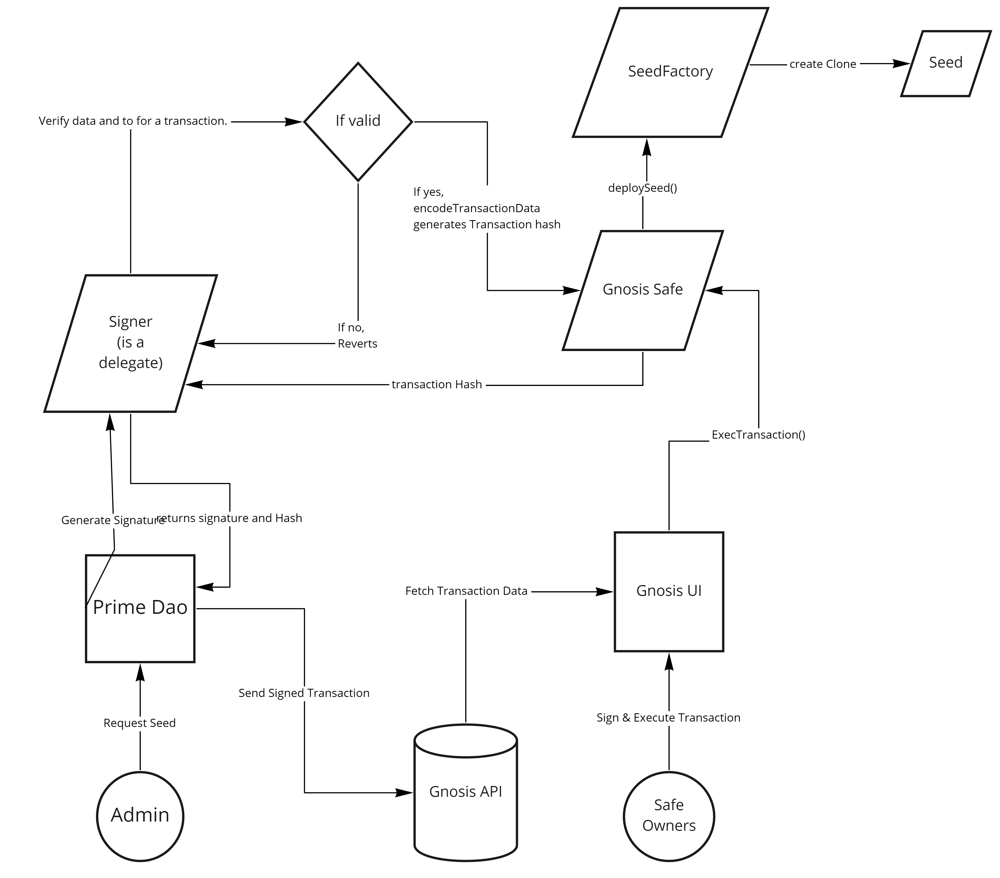

## PrimeDAO Gnosis Safe integration

### High level overview
The dApp should send the deploySeed() transaction request to Gnosis, where the Multi-sig Owners can sign and execute transactions.

## Approach
Gnosis provides two services
1) Gnosis Safe Transactions Service [GTS]:- Keeps track of transactions sent via Gnosis Safe contracts. https://docs.gnosis.io/safe/docs/services_transactions/
2) Gnosis Safe Relay Service [GRS]:- The transaction relay service that acts as a proxy, paying for the transaction fees and getting it back. https://docs.gnosis.io/safe/docs/services_relay/

The Transactions can be sent to the GTS, where it verifies the transaction signatures. The transaction can be sent with or without signatures. When Transactions are sent without signatures, the Gnosis UI doesn't read this transaction, as it will assume it's a spam. When transactions are sent with signatures, the Gnosis UI will read this transaction and allow owners to sign & execute transaction from Gnosis UI.

We have a contract `Signer`, that acts as a delegate for the GTS. The `Signer` contract should be added as a delegate by any of the Safe owners,  so the transactions could be sent to GTS, signed by `Signer` contract. As it is signed by delegate, the Gnosis UI will fetch this transaction and enable other owners to sign and execute this transactions.

Architecture overview:



## Gnosis API Setup

1. Import Gnosis.js
```js
import {api} from 'Gnosis.js';
```

2. Instantiate the `api` object
```js
const safe = api(_gnosisSafeAddress_);
```

3. Ready to go!

## Gnosis API Interaction

### `sendTransaction`
It is used to send transaction to Gnosis API. It needs to be signed by `owner` or `delegates` of the Safe.

#### Input
1. `payload`: Object
    ```js
    {
        // should be zero for now
        baseGas: 0,

        // will get this from Signer contract when generateSignature is called
        contractTransactionHash: "0x23c4a038...", 

        // encoded data for this transaction
        data: "0x815c5d4a...", 

        // should be zero for now
        gasPrice: 0 ,

        // should be zero address for now
        gasToken: "0x0000000000000000000000000000000000000000" ,

        // get this using gnosis.getCurrentNonce()
        nonce: 66 ,

        // should be 0
        operation: 0 ,

        // should be zero address for now
        refundReceiver: "0x0000000000000000000000000000000000000000",

        // address of safe 
        safe: "0x2E46E481d57477A0663a7Ec61E7eDc65F4cb7F5C" ,

        // get this using gnosis.getEstimate()
        safeTxGas: "455162" ,

        // the sender of this transaction, one who sends it to gnosis API, this won't necessary be the person who execute it.
        sender: "0x97df9a9c351d144934c8e9BbaB5b304a0482f53f", 

        // signature of the sender, sign the contractTransactionHash
        signature: "0x00000000..." ,

        // the receiver, mostly for us it will be seedFactory
        to: "0x455C45006C3872d8de9afd4733dBb9b3B2Ade525",

        // value should be zero, for us
        value: 0 ,
    }
    ```

#### Output
1. Status Code: Number

#### Example
```js
// Gnosis API object should be instantiated
const safeAddress = "0x2E46E481d57477A0663a7Ec61E7eDc65F4cb7F5C"
const gnosis = api(safeAddress);

const payload = {
    baseGas: 0,
    contractTransactionHash: "0x23c4a038...",
    data: "0x815c5d4a...",
    gasPrice: 0,
    gasToken: "0x0000000000000000000000000000000000000000",
    nonce: 66,
    operation: 0,
    refundReceiver: "0x0000000000000000000000000000000000000000",
    safe: "0x2E46E481d57477A0663a7Ec61E7eDc65F4cb7F5C",
    safeTxGas: "455162",
    sender: "0x97df9a9c351d144934c8e9BbaB5b304a0482f53f",
    signature: "0x00000000...",
    to: "0x455C45006C3872d8de9afd4733dBb9b3B2Ade525",
    value: 0
}

await gnosis.sendTransaction(payload);
```

### `addDelegate`
It is used to add `delegate` for Gnosis API. This delegate can send transaction to Gnosis API but they are not the owner of safe so delegate's signature cannot be used to execute the transaction.

#### Input
1. `payload`: Object
    ```js
    {
        safe: "Safe address [required]",
        delegate: "delegate Address [required]",
        signature: "signature generated after signing hash [required]",
        label: "an identifier for this delegate [required]"
    }
    ```

#### Output
1. Status Code: Number

#### Example
```js
// variables to store the addresses and label
const delegateAddress = "0x97df9a9c351d144934c8e9BbaB5b304a0482f53f";
const safeAddress = "0x2E46E481d57477A0663a7Ec61E7eDc65F4cb7F5C";
const label = "Signer";

// instantiate Gnosis Api
const gnosis = api(safeAddress);

// generate a totp - as mentioned by Gnosis
// totp = current timestamp (in seconds) / 3600 [natural division, no floating point]
// time-based one-time-password
const totp = Math.floor(Math.floor(Date.now()/1000) / 3600);

// create a hash, concat delegateAddress + totp [not addition]
const hash = keccak(delegateAddress+totp.toString());

// this hash should be signed by safe owner
// below example is with metamask injected window.ethereum
// should be `eth_sign`
const signature = await window.ethereum.request({method: 'eth_sign', params: [currentAccount, hash]});

// create a payload to be sent to Gnosis API
const payload = {
    safe: safeAddress,
    delegate: delegateAddress,
    signature: signature,
    label: label
};

// call gnosis.addDelegate() with payload
await gnosis.addDelegate(payload);
```

### `getDelegates`
Fetch all the delegates and the delegators[person who added them as a delegate] for the delegates. 

#### Output
1. Array of Object. 
    ```js
    [
        {
            delegate: "Address of delegate",
            delegator: "Address of safe owner who added delegate",
            label: "Label for the delegator"
        }
    ]
    ```

#### Example
```js
// Gnosis API object should be instantiated
const safeAddress = "0x2E46E481d57477A0663a7Ec61E7eDc65F4cb7F5C"
const gnosis = api(safeAddress);

// call gnosis.getDelegates to fetch delegates
await gnosis.getDelegates();
// [
//     {
//         delegate: "0x97df9a9c351d144934c8e9BbaB5b304a0482f53f",
//         delegator: "0x67BE2C36e75B7439ffc2DCb99dBdF4fbB2455930",
//         label: "Signer"
//     }
// ]
```

### `getTransactionHistory`
Fetch all the transactions from Gnosis API for the supplied safe address.

#### Output
1. Array of Object. Latest Transaction on zeroth index and so on.
    ```js
    [
        {
            // Transaction details
        }
    ]
    ```

#### Example
```js
// Gnosis API object should be instantiated
const safeAddress = "0x2E46E481d57477A0663a7Ec61E7eDc65F4cb7F5C"
const gnosis = api(safeAddress);

// call gnosis.getTransactionHistory()
await gnosis.getTransactionHistory();
// [
//     {
//         // Lastest Transaction
//     },
//     .
//     .
//     .
//     {
//         // Transactions
//     },
//     .
//     .
//     .
//     {
//         // First Transaction
//     }
// ]
```

### `getEstimate`
Gets estimate from Relay Service for a transaction

#### Input
1. `params`: Object
    ```js
    {
        to: "address ", // for us mostly seedFactory
        value: ,// Number; in wei; for us mostly 0,
        operation: , // Number; type of call being made; for us mostly 0
        safe: "address of gnosis safe",
        data: "", // encoded data for this transaction, for us mostly encoded deploySeed(...arguments)
    }
    ```

#### Output 
1. `response`: Object 
    ```js
    // All we need from below object is safeTxGas
    {
        baseGas: "58936",
        dataGas: "58936",
        gasPrice: "4266666667",
        gasToken: "0x0000000000000000000000000000000000000000",
        lastUsedNonce: 65,
        operationalGas: "0",
        refundReceiver: "0x07fd2865c8DE725B4e1f4E2B72E5c654baA7c4b3",
        safeTxGas: "455162"
    }
    ```

#### Example
```js
// Gnosis API object should be instantiated
const safeAddress = "0x2E46E481d57477A0663a7Ec61E7eDc65F4cb7F5C"
const gnosis = api(safeAddress);

const params = {
    to: "0x455C45006C3872d8de9afd4733dBb9b3B2Ade525",
    value: 0,
    operation: 0,
    safe: "0x2E46E481d57477A0663a7Ec61E7eDc65F4cb7F5C",
    data: "0x815c5d4a...",
}

// call gnosis.getEstimate() with params
const estimate = await gnosis.getEstimate(params);
// {
//     baseGas: "58936",
//     dataGas: "58936",
//     gasPrice: "6666666667",
//     gasToken: "0x0000000000000000000000000000000000000000",
//     lastUsedNonce: 65,
//     operationalGas: "0",
//     refundReceiver: "0x07fd2865c8DE725B4e1f4E2B72E5c654baA7c4b3",
//     safeTxGas: "455162"
// }

// All we might need is this
const safeTxGas = estimate.safeTxGas;
```

### `getCurrentNonce`
Gets current valid nonce for the safe transactions

#### Output
1. `nonce`: Number

#### Example
```js
// Gnosis API object should be instantiated
const safeAddress = "0x2E46E481d57477A0663a7Ec61E7eDc65F4cb7F5C"
const gnosis = api(safeAddress);

// call gnosis.getCurrentNonce() to get current valid nonce
await gnosis.getCurrentNonce();
// 66
```

## Configurations
1. Please add the following details in `.env` file.
    1. PROVIDER_KEY - Infura api key
    2. MNEMONIC - EOA private key or mnemonic phrase.

2. Please add following details in `config.js` file.
    1. ADMIN - Seed admin address
    2. SAFE - Gnosis Safe address
    3. BENEFICIARY - Beneficiary address 

## For Front-end

### How to add Delegate

1. Setup parameters
```js
const delegate = signer;
const label = "Signer";
const safe = SAFE;
const totp = Math.floor(Math.floor(Date.now()/1000) / 3600);
```

2. Create a hash
```js
const dataToBeHashed = delegate+totp.toString();
const hash = keccak256(dataToBeHashed);
// ethers.js does the hash in the below function so no need to do it from our side
const signature = await wallet.signMessage(dataToBeHashed);
```

3. Create a payload and send transaction
```js
const payload = {
    safe,
    delegate,
    label,
    signature
};
await gnosis.addDelegate(payload);
```

### How to Send transaction.

0. Import Gnosis file created in-house
```js
import {api} from './Gnosis';
```

1. Setup gnosis api for a SAFE:-
```js
const SAFE = 'Address of gnosis safe';
const gnosis = api(SAFE);
```

2. Start populating transaction object:-
```js
const transaction = {};

transaction.to = this.seedFactory.options.address;
transaction.value = 0;
transaction.operation = 0;
transaction.safe = this.safe.options.address;
transaction.data = this.seedFactory.methods.deploySeed(...seedArguments).encodeABI();
```

3. Get transaction estimate:-
```js
const estimate = await gnosis.getEstimate(transaction);
transaction.safeTxGas = estimate.safeTxGas;
```

4. Add payment related details
```js
transaction.baseGas        = 0;
transaction.gasPrice       = 0;
transaction.gasToken       = '0x0000000000000000000000000000000000000000';
transaction.refundReceiver = '0x0000000000000000000000000000000000000000';
```

5. Get Nonce
```js
transaction.nonce = await gnosis.getCurrentNonce();
```

6. Call(), send details to Signer contract to generate hash and sign the hash.
```js
const {hash, signature} = await this.signerContract.methods.generateSignature(
			transaction.to,
			transaction.value,
			transaction.data,
			transaction.operation,
			transaction.safeTxGas,
			transaction.baseGas,
			transaction.gasPrice,
			transaction.gasToken,
			transaction.refundReceiver,
			transaction.nonce
		).call();
		transaction.contractTransactionHash = hash;
		transaction.signature = signature;
```

7. Send signatureContract.generateSignature() to do a transaction and store signature in contract
```js
await signatureContract.methods.generateSignature(transaction.contractTransactionHash).send(options));
```

9. Add sender to the transaction object
```js
transaction.sender = signatureContract.options.address;
```

10. Send the transaction object to Gnosis Safe Transaction service
```js
const response = await gnosis.sendTransaction(transaction);
```
